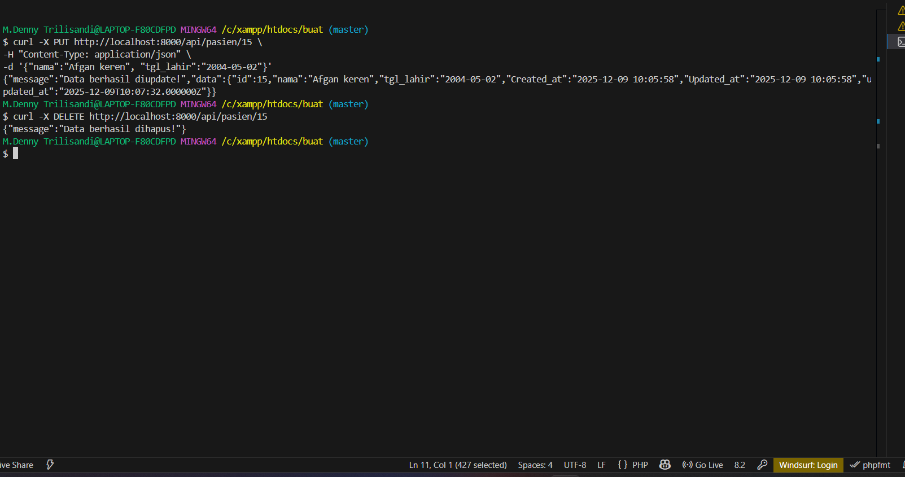

# 1. Clone repository
git clone https://github.com/username/nama-project.git
cd nama-project

# 2. Install dependensi composer
composer install

# 3. Copy file environment
cp .env.example .env

# 4. Konfigurasi database
# Buka file .env dan sesuaikan DB_DATABASE, DB_USERNAME, DB_PASSWORD

# 5. Jalankan migrasi database
php artisan migrate

# 6. Jalankan server Laravel
php artisan serve
# Akses aplikasi di: http://127.0.0.1:8000

## Contoh API

### GET & POST

### UPDATE & DELETE

